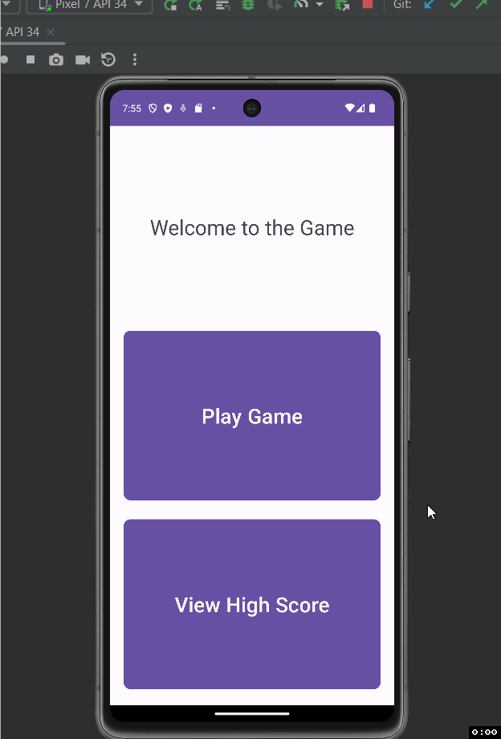

Midterm Game

Description of the project ...

- The project is an application that is a game where the user will guess the random number and once guessed correctly, the application will send information back to the main screen and also save the info to the database where it can be retrieved and displayed when looking in the high scores screen.

## Functionality 

The following **required** functionality is completed:

* [ ] Uses correct names, is well documented code, and uses naming conventions. 
* [ ] Correct layout for portrait mode of Main Screen 
* [ ] Correct layout for landscape mode of Main Screen 
* [ ] Correct Navigations from Main to the other two screens 
* [ ] Padding used for components in Main Screen 
* [ ] Tapping EditText shows numbers only 
* [ ] Image buttons used and increment and decrement correctly without crashing 
* [ ] Shows Toast 
* [ ] Sound is played 
* [ ] Screen finished when correct guess is made 
* [ ] Stores, and retrieves high scores in the database using Room database 
* [ ] Game Screen sends data back to Main Screen 
* [ ] RecyclerView (with data binding and DiffUtil) is used to display the high scores 
* [ ] Correct layout for the two Fragments of Game Screen 
* [ ] Use of view models to communicate with the database 
* [ ] Application does not crash
* [ ] View Model implementation for communication between Game Screen and its 2 fragments 
* [ ] Delete functionality (should show a dialog using dialog fragment and delete the item if confirmed) 
* [ ] README.md file

The following **extensions** are implemented:

* No Extensions were used. Everything was from Kotlin

## Video Walkthrough

Here's a walkthrough of implemented user stories:

GIF created with [LiceCap](http://www.cockos.com/licecap/).

## Notes

Describe any challenges encountered while building the app.

- Understanding, using, and implementing the database.

## License

    Copyright [yyyy] [name of copyright owner]

    Licensed under the Apache License, Version 2.0 (the "License");
    you may not use this file except in compliance with the License.
    You may obtain a copy of the License at

        http://www.apache.org/licenses/LICENSE-2.0

    Unless required by applicable law or agreed to in writing, software
    distributed under the License is distributed on an "AS IS" BASIS,
    WITHOUT WARRANTIES OR CONDITIONS OF ANY KIND, either express or implied.
    See the License for the specific language governing permissions and
    limitations under the License.
